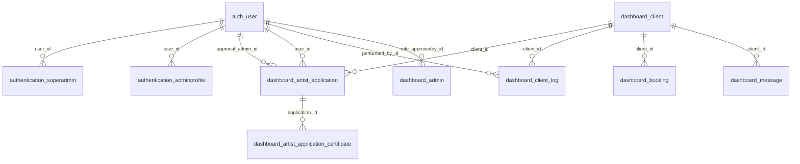

# FloDo — Django Admin Dashboard (Django 4.2.x)

[](https://ishwarchoudhari.github.io/FloDo/)
[](https://www.python.org/)
[](https://www.djangoproject.com/)
[](LICENSE)

## 📚 Official Documentation

This repository includes an official documentation site under the `docs/` directory:

- Start here: [`docs/index.md`](docs/index.md)
- Getting Started: [`docs/getting-started.md`](docs/getting-started.md)
- Architecture: [`docs/architecture.md`](docs/architecture.md)
- API Reference: [`docs/api.md`](docs/api.md)
- Security: [`docs/security.md`](docs/security.md)
- Deployment: [`docs/deployment.md`](docs/deployment.md)
- Contributing: [`docs/contributing.md`](docs/contributing.md)

To publish documentation with GitHub Pages:

1. Push this repository to GitHub.
2. In your GitHub repo, go to Settings → Pages.
3. Under "Build and deployment", choose "Deploy from a branch".
4. Select branch `main` and folder `/docs`.
5. Save. Your docs will be available at `https://<your-username>.github.io/<repo-name>/`.

> Tip: You can keep using plain Markdown in `docs/`, or add a static site generator later (e.g., MkDocs) without changing the content.

## 📝 Overview

FloDo is a production‑ready Django admin dashboard that provides secure Super‑Admin workflows, profile management (including avatar uploads), dynamic CRUD tables, activity logs, and a responsive Tailwind UI with dark mode. Real‑time notifications are supported via Django Channels (ASGI/Daphne). The project ships with clear docs, sensible defaults, and a streamlined developer workflow for local and cloud deployments.

## 🚀 Quick Start

### Prerequisites

- Python 3.12 (recommended)
- Windows PowerShell (for examples below)
- SQLite (default) or Postgres (optional)

### Installation (Windows PowerShell)

1. Navigate to the project directory that contains `manage.py`:

   ```powershell
   Set-Location .\django_admin_project
   ```

2. Create and activate a virtual environment:

   ```powershell
   python -m venv .venv
   . .\.venv\Scripts\Activate.ps1
   ```

3. Install dependencies:

   ```powershell
   pip install --upgrade pip
   pip install -r requirements.txt
   ```

4. Apply database migrations and collect static files:

   ```powershell
   python manage.py migrate
   python manage.py collectstatic --noinput
   ```

5. (Optional) Create sample data or a super-admin via the UI:

   - Visit `/signup/` in the browser to create the initial super-admin if none exists.

6. Run the application (choose one):

   - Simple dev server:

     ```powershell
     python manage.py runserver 127.0.0.1:8000
     ```

   - Daphne (ASGI) for WebSockets support:

     ```powershell
     daphne django_admin_project.asgi:application --port 8000
     ```

### Real‑time Notifications (WebSocket Channel Layer)

This project uses Django Channels for real-time notifications. You can run it in either mode:

- In-memory (single process, local dev):

  ```powershell
  $env:USE_INMEMORY_CHANNEL_LAYER = "1"
  daphne django_admin_project.asgi:application --port 8000
  ```

- Redis-backed (multi-process or containers):

  1) Ensure Redis is running (e.g., `docker-compose up redis`).
  2) Set `REDIS_URL` if needed (default is fine for local): `redis://127.0.0.1:6379/0`.
  3) Start Daphne as above.

### Environment Configuration

You can set the following environment variables (e.g., in PowerShell before starting the server):

```powershell
$env:DJANGO_DEBUG = "True"              # set to "False" for production
$env:DJANGO_SECRET_KEY = "dev-secret"   # set a strong secret in production
$env:DJANGO_ALLOWED_HOSTS = "127.0.0.1,localhost"
```

### Email/SMTP Configuration (for OTP emails)

Set these variables in the same terminal session you run the server from. For Gmail, use an App Password (not your normal password).

```powershell
# Select SMTP backend (overrides console backend in DEBUG)
$env:EMAIL_BACKEND = "django.core.mail.backends.smtp.EmailBackend"

# Sender and SMTP server
$env:DEFAULT_FROM_EMAIL = "no-reply@example.com"   # or your Gmail address
$env:EMAIL_HOST = "smtp.gmail.com"
$env:EMAIL_PORT = "587"
$env:EMAIL_USE_TLS = "True"    # STARTTLS on 587
$env:EMAIL_USE_SSL = "False"

# Credentials
$env:EMAIL_HOST_USER = "you@gmail.com"
$env:EMAIL_HOST_PASSWORD = "<GMAIL_APP_PASSWORD>"

# Optional
$env:EMAIL_TIMEOUT = "10"
```

Test a one-off email send via Django shell:

```powershell
python manage.py shell -c "from django.template.loader import render_to_string; from django.conf import settings; from django.core.mail import EmailMultiAlternatives; to=getattr(settings,'DEFAULT_FROM_EMAIL','no-reply@localhost'); ctx={'code':'123456','expiry_minutes':10,'app_name':getattr(settings,'APP_NAME','FloDo'),'login_url':'http://127.0.0.1:8000/Super-Admin/auth/login/'}; html=render_to_string('emails/otp_email.html',ctx); txt=render_to_string('emails/otp_email.txt',ctx); msg=EmailMultiAlternatives('FloDo OTP Test',txt,getattr(settings,'DEFAULT_FROM_EMAIL','no-reply@localhost'),[to]); msg.attach_alternative(html,'text/html'); print('Sent:', msg.send(fail_silently=False))"
```

## 📚 Documentation

- Start here: [`docs/index.md`](docs/index.md)
- Getting Started: [`docs/getting-started.md`](docs/getting-started.md)
- Architecture: [`docs/architecture.md`](docs/architecture.md)
- API Reference: [`docs/api.md`](docs/api.md)
- Security: [`docs/security.md`](docs/security.md)
- Deep Technical Report & ERD: [`docs/appendix-tech-report.md`](docs/appendix-tech-report.md)

## 🔧 Development

- Tests (suggested): `python manage.py test`
- Static files: `python manage.py collectstatic --noinput`
- Optional: see docs for deployment and security hardening.

## ✨ Key Features

- Secure Super‑Admin authentication (AJAX login/signup)
- Profile management with avatar uploads and validation
- 10+ dynamic CRUD tables with filtering and pagination
- Real‑time activity logs (Django Channels/Daphne)
- Settings center (profile, app settings, system info, exports)
- Clean, responsive Tailwind UI with dark mode
- CSRF protection, WhiteNoise static serving, production hardening

### OTP Password Reset UX

- Super‑Admin “Forgot password?” flows via AJAX under `/Super-Admin/auth/`.
- OTP requests start a 10‑minute countdown (with animated visual timer).
- OTP entry uses 6 split boxes (GitHub‑style): auto‑advance, backspace to previous, paste support.
- Auto‑submit verifies the code once all digits are entered; error states show red ring + subtle shake.
- After verification, the reset step requires password and confirm password with live match indicators; the Reset button only enables when matching.

### Branded OTP Emails (HTML + Plain Text)

- HTML template: `templates/emails/otp_email.html`
- Plain text fallback: `templates/emails/otp_email.txt`
- Emails sent with `EmailMultiAlternatives` and include:
  - Greeting, highlighted OTP, expiry note, “Continue to Login” button, and FloDo signature.
- Backend remains generic and secure (no user enumeration). Failing to send email does not break the flow.

## 🛡️ Security

CSRF protection is enabled globally (Fetch includes `X-CSRFToken` and/or `csrfmiddlewaretoken` in forms). See [`docs/security.md`](docs/security.md) for production hardening.

## 🚀 Deployment

See the docs for production guidance, including static/media serving, ASGI, and security settings.

### Deploy on

- [Render](https://render.com/): simple Docker/WSGI/ASGI deploy
- [Railway](https://railway.app/): one‑click Docker or buildpack
- [Fly.io](https://fly.io/): global Docker deploy with volumes
- Azure App Service / AWS Elastic Beanstalk / GCP App Engine: PaaS options for Django
- Static docs (this repo): GitHub Pages — Settings → Pages → main → /docs

## 🤝 Contributing

Guidelines coming soon (`docs/contributing.md`).

## 📞 Support

Open an issue in GitHub with details and reproduction steps.

1. **Tailwind CSS**

- Version: via CDN (no local build observed)
  - Files: `templates/base.html` include; utility classes across `templates/*`

1. **Custom CSS**

- Version: N/A
- Files: `static/css/login.css`

1. **Database: SQLite**

- Version: SQLite via Python stdlib
- Files: `django_admin_project/settings.py` (`ENGINE='django.db.backends.sqlite3'`), `db.sqlite3`

1. **jQuery**

- Version: present only in Django admin vendor assets; not used by app UI
- Files: `staticfiles/admin/js/vendor/jquery/*` (collected static)

1. **HTMX**

- Usage: Not detected
- Files: N/A

## Appendix

To keep this README concise, the deep technical report, table inventory, ERD, and extended notes have been moved to [`docs/appendix-tech-report.md`](docs/appendix-tech-report.md).
│   ├── urls.py (1.4 KB)
│   └── wsgi.py (499 B)
├── fixtures/
│   └── sample_data.json (10.4 KB)
├── htmlcov/
├── manage.py (1.2 KB)
├── media/
│   └── avatars/
├── node_modules/
├── package-lock.json (8.5 KB)
├── package.json (117 B)
├── pytest.ini (92 B)
├── requirements.txt (856 B)
├── static/
│   ├── css/
│   │   ├── .gitkeep (0 B)
│   │   └── login.css (4.1 KB)
│   ├── images/
│   │   └── .gitkeep (0 B)
│   └── js/
│       ├── auth.js (4.8 KB)
│       ├── common.js (6.1 KB)
│       ├── dashboard.js (29.2 KB)
│       └── notifications.js (18.3 KB)
├── staticfiles/  [collectstatic output]
│   ├── admin/ (Django admin vendor assets)
│   ├── css/ (...)
│   ├── js/ (...)
│   └── staticfiles.json (10.4 KB)
├── templates/
│   ├── 404.html (694 B)
│   ├── 500.html (681 B)
│   ├── auth/
│   │   ├── login.html (2.7 KB)
│   │   └── signup.html (3.5 KB)
│   ├── base.html (34.2 KB)
│   ├── dashboard/
│   │   ├── index.html (4.8 KB)
│   │   ├── tables_full.html (391 B)
│   │   └── tables_partial.html (6.5 KB)
│   ├── partials/
│   │   ├── _footer.html (238 B)
│   │   ├── _header.html (4.4 KB)
│   │   └── sidebar.html (8.2 KB)
│   ├── profile/
│   │   └── admin_profile.html (9.1 KB)
│   └── settings/
│       └── index.html (6.3 KB)
├── tests/
│   ├── __pycache__/
│   ├── test_auth.py (1.4 KB)
│   └── test_dashboard.py (0.9 KB)
└── apps/
    ├── __init__.py (22 B)
    ├── authentication/
    │   ├── __init__.py (29 B)
    │   ├── admin.py (2.4 KB)
    │   ├── apps.py (201 B)
    │   ├── constants.py (359 B)
    │   ├── forms.py (701 B)
    │   ├── middleware.py (1.9 KB)
    │   ├── migrations/ (6 items)
    │   ├── models.py (1.7 KB)
    │   ├── urls.py (1.0 KB)
    │   └── views.py (9.0 KB)
    ├── dashboard/
    │   ├── __init__.py (24 B)
    │   ├── admin.py (433 B)
    │   ├── apps.py (503 B)
    │   ├── migrations/ (6 items)
    │   ├── models.py (2.4 KB)
    │   ├── signals.py (1.6 KB)
    │   ├── urls.py (601 B)
    │   └── views.py (13.7 KB)
    ├── security/
    │   └── __init__.py (61 B)
    └── settings_app/
        ├── __init__.py (23 B)
        ├── apps.py (190 B)
        ├── context_processors.py (465 B)
        ├── forms.py (463 B)
        ├── migrations/ (4 items)
        ├── models.py (557 B)
        ├── urls.py (404 B)
        └── views.py (4.4 KB)
```

## Database Schema

### Models Overview

| Model Name   | App            | Table Name                     | Purpose                                   | Key Relationships |
|--------------|----------------|--------------------------------|-------------------------------------------|-------------------|
| SuperAdmin   | authentication | authentication_superadmin      | Marks the single super-admin profile      | 1:1 User          |
| AdminProfile | authentication | authentication_adminprofile    | Admin profile incl. avatar/social links   | 1:1 User          |
| AppSettings  | settings_app   | settings_app_appsettings       | App-level settings                        | FK User(updated_by)|
| Table1       | dashboard      | dashboard_admin                | Demo CRUD table                           | —                 |
| Table2       | dashboard      | dashboard_user                 | Demo CRUD table                           | —                 |
| Table3       | dashboard      | dashboard_verified_artist      | Demo CRUD table                           | —                 |
| Table4       | dashboard      | dashboard_payment              | Demo CRUD table                           | —                 |
| Table5       | dashboard      | dashboard_artist_service       | Demo CRUD table                           | —                 |
| Table6       | dashboard      | dashboard_artist_application   | Demo CRUD table                           | —                 |
| Table7       | dashboard      | dashboard_artist_availability  | Demo CRUD table                           | —                 |
| Table8       | dashboard      | dashboard_artist_calendar      | Demo CRUD table                           | —                 |
| Table9       | dashboard      | dashboard_booking              | Demo CRUD table                           | —                 |
| Table10      | dashboard      | dashboard_message              | Demo CRUD table                           | —                 |
| ActivityLog  | dashboard      | dashboard_activitylog          | Audit log of CRUD operations              | FK User(admin_user)|

### Detailed Model Documentation

#### SuperAdmin
**File:** `apps/authentication/models.py`
**Database Table:** `authentication_superadmin`
**Purpose:** 1:1 marker of the single super-admin user and metadata.

**Fields:**
| Field Name     | Type                   | Constraints                 | Description |
|----------------|------------------------|-----------------------------|-------------|
| user           | OneToOneField(User)    | on_delete=CASCADE, unique   | Link to `auth_user` |
| is_super_admin | BooleanField           | default=True                | Marker flag |
| created_at     | DateTimeField          | auto_now_add=True           | Created timestamp |
| last_login_ip  | GenericIPAddressField  | null=True, blank=True       | Last login IP |

**Relationships:**
- Foreign Keys: to `auth.User` (1:1)
- Reverse relationships: `user.super_admin_profile`

#### AdminProfile
**File:** `apps/authentication/models.py`
**Database Table:** `authentication_adminprofile`
**Purpose:** Profile info and avatar for admin user.

**Fields:**
| Field Name   | Type            | Constraints                 | Description |
|--------------|-----------------|-----------------------------|-------------|
| user         | OneToOneField   | on_delete=CASCADE, unique   | Link to `auth_user` |
| avatar       | ImageField      | upload_to="avatars/"        | Optional avatar |
| display_name | CharField(150)  | blank=True, default=""      | Display name |
| role         | CharField(100)  | blank=True, default="Admin" | Role |
| bio          | TextField       | blank=True, default=""      | Bio |
| location     | CharField(120)  | blank=True, default=""      | Location |
| birth_date   | DateField       | null=True, blank=True        | DOB |
| phone        | CharField(32)   | blank=True, default=""      | Phone with country code |
| status       | CharField(20)   | blank=True, default="online"| Presence |
| last_sign_in | DateTimeField   | null=True, blank=True        | Last sign-in |
| social_links | JSONField       | default=dict, blank=True     | Social links map |
| created_at   | DateTimeField   | auto_now_add=True            | Created |
| updated_at   | DateTimeField   | auto_now=True                | Updated |

**Relationships:** 1:1 `auth.User` (reverse: `user.admin_profile`)

#### AppSettings
**File:** `apps/settings_app/models.py`
**Database Table:** `settings_app_appsettings`
**Purpose:** Application-wide settings and preferences.

**Fields:**
| Field Name           | Type            | Constraints        | Description |
|----------------------|-----------------|--------------------|-------------|
| app_name             | CharField(100)  | default="Admin Dashboard" | App name |
| timezone             | CharField(50)   | default="UTC"     | Timezone |
| records_per_page     | IntegerField    | default=10         | Pagination size |
| enable_notifications | BooleanField    | default=True       | Toggle |
| updated_by           | ForeignKey(User)| on_delete=CASCADE  | Last editor |
| updated_at           | DateTimeField   | auto_now=True      | Updated |

#### BaseTable and Table1–Table10
**File:** `apps/dashboard/models.py`
**Database Table:** concrete per class (see below)
**Purpose:** 10 demo tables inheriting common fields for CRUD.

Base fields (in `BaseTable`, abstract):
- `unique_id` (AutoField, PK)
- `name` (CharField, db_index=True)
- `city` (CharField, db_index=True)
- `phone` (CharField)
- `created_at` (DateTimeField, auto_now_add=True)
- `updated_at` (DateTimeField, auto_now=True)
- Indexes: on `name`, `city`

Concrete models set `db_table`:
- Table1 → `dashboard_admin`
- Table2 → `dashboard_user`
- Table3 → `dashboard_verified_artist`
- Table4 → `dashboard_payment`
- Table5 → `dashboard_artist_service`
- Table6 → `dashboard_artist_application`
- Table7 → `dashboard_artist_availability`
- Table8 → `dashboard_artist_calendar`
- Table9 → `dashboard_booking`
- Table10 → `dashboard_message`

#### ActivityLog
**File:** `apps/dashboard/models.py`
**Database Table:** `dashboard_activitylog`
**Purpose:** Append-only log of create/update/delete actions.

Fields: `table_name` (str), `action` (str), `row_id` (int), `row_details` (JSON), `timestamp` (auto), `admin_user` (FK User). Ordering by `-timestamp`.

## URL Structure & Views

### URL Patterns

| URL Pattern | View | Type | Methods | Template | Purpose |
|-------------|------|------|---------|----------|---------|
| `/` and `/login/` | `authentication.views.login_view` | FBV | GET (page), POST (login) | `templates/auth/login.html` | Super-admin login |
| `/signup/` | `authentication.views.signup_view` | FBV | GET (page), POST (create) | `templates/auth/signup.html` | First-time admin creation |
| `/logout/` | `authentication.views.logout_view` | FBV | POST | n/a (JSON) | Logout via AJAX |
| `/auth-status/`, `/api/check-auth/` | `authentication.views.check_auth_status` | FBV | GET | n/a (JSON) | Auth status JSON |
| `/profile/` | `authentication.views.profile_view` | FBV | GET | `templates/profile/admin_profile.html` (partial) | Profile partial HTML |
| `/profile/update/` | `authentication.views.profile_update` | FBV | POST | n/a (JSON) | Update profile fields |
| `/profile/avatar/` | `authentication.views.profile_avatar_upload` | FBV | POST | n/a (JSON) | Upload avatar |
| `/profile/avatar/delete/` | `authentication.views.profile_avatar_delete` | FBV | POST | n/a (JSON) | Delete avatar |
| `/profile/password/` | `authentication.views.profile_password_change` | FBV | POST | n/a (JSON) | Change password |
| `/dashboard/` | `dashboard.views.dashboard_view` | FBV | GET | `templates/dashboard/index.html` | Dashboard overview |
| `/dashboard/tables/` | `dashboard.views.tables_view` | FBV | GET | full/partial templates | Tables UI page/partial |
| `/dashboard/api/table/<int:table_id>/` | `dashboard.views.get_table_data` | FBV | GET (query params) | n/a (JSON) | Paginated list with q,page,per_page |
| `/dashboard/api/table/<int:table_id>/row/` | `dashboard.views.table_crud_api` | FBV | POST (create) | n/a (JSON) | Create row |
| `/dashboard/api/table/<int:table_id>/row/<int:row_id>/` | `dashboard.views.table_crud_api` | FBV | PUT/DELETE or POST with `_method` | n/a (JSON) | Update/Delete row |
| `/dashboard/api/table/config/` | `dashboard.views.update_table_config` | FBV | POST | n/a (JSON) | Update labels (session) |
| `/dashboard/api/logs/` | `dashboard.views.get_logs` | FBV | GET | n/a (JSON) | Paginated logs |
| `/settings/` | `settings_app.views.settings_home` | FBV | GET | `templates/settings/index.html` | Settings landing |
| `/settings/profile/` | `settings_app.views.profile_update` | FBV | POST | n/a (JSON) | Update username/email/password |
| `/settings/app/` | `settings_app.views.app_update` | FBV | POST | n/a (JSON) | Update app settings |
| `/settings/export/<str:fmt>/<int:table_id>/` | `settings_app.views.export_table` | FBV | GET | CSV/JSON | Export data |
| `/settings/system-info/` | `settings_app.views.system_info` | FBV | GET | JSON | System info |

### View Documentation

- Authentication views: function-based, CSRF-protected, some with simple rate limiting. Profile endpoints require authentication.
- Dashboard views: function-based, CSRF on mutation endpoints, `transaction.atomic` on CRUD. Pagination via `Paginator`, search with `Q` objects. ActivityLog updated via API and signals.
- Settings views: function-based, profile update supports password change with re-authentication; export outputs CSV/JSON; system-info aggregates counts and DB size.

## Applications

### authentication
**Purpose:** Super-admin account bootstrap, login/logout, profile management.
**Files Structure:** See tree above (models/forms/views/urls/middleware/admin/migrations).
**Key Features:** Single-account signup, AJAX login/logout, profile CRUD, avatar upload with Pillow validation, basic rate limiting.
**Dependencies:** Django auth, Pillow.

### dashboard
**Purpose:** Dashboard UI, 10 CRUD tables, activity logging.
**Files Structure:** models/views/urls/signals/admin/migrations.
**Key Features:** Search/paginate, method override for PUT/DELETE, session-based label config, logs API, signals for auditing.
**Dependencies:** Django ORM, `apps.settings_app` for page size.

### settings_app
**Purpose:** App/user settings, exports, system info.
**Files Structure:** models/views/urls/forms/context_processors/migrations.
**Key Features:** Update profile/app settings, CSV/JSON export, system info report, context processor for template globals.
**Dependencies:** Django auth, `apps.dashboard` models.

## Templates Structure

### Template Hierarchy

```text
templates/
├── base.html  (root layout; blocks: title, content, scripts)
├── partials/
│   ├── _header.html
│   ├── sidebar.html
│   └── _footer.html
├── auth/
│   ├── login.html    (extends base)
│   └── signup.html   (extends base)
├── dashboard/
│   ├── index.html    (extends base)
│   ├── tables_full.html    (extends base)
│   └── tables_partial.html (AJAX fragment)
├── settings/index.html     (extends base)
└── profile/admin_profile.html (partial)
```

### Template Documentation

| Template | Extends | Blocks | Context Variables | Purpose |
|----------|---------|--------|-------------------|---------|
| base.html | n/a | title, content, scripts | `csp_nonce`, app settings globals | Global layout, nonce/CSP, script loader |
| auth/login.html | base.html | title, content, scripts | CSRF token | Super-admin login UI + auth.js |
| auth/signup.html | base.html | title, content, scripts | CSRF token | One-time super-admin signup |
| dashboard/index.html | base.html | content | counts/logs | Dashboard overview |
| dashboard/tables_full.html | base.html | content | table labels/config | Tables page (full) |
| dashboard/tables_partial.html | base.html | content | table data, pagination | Partial replacement via AJAX |
| settings/index.html | base.html | content, scripts | app/user settings, system info | Settings landing |
| profile/admin_profile.html | base.html or partial | content | profile data | Profile section partial |

## Static Files

### CSS Files

| File | Purpose | Components Styled |
|------|---------|-------------------|
| static/css/login.css | Glassmorphism auth UI | Login/Signup cards, inputs, buttons |

### JavaScript Files

| File | Purpose | Functions | Dependencies |
|------|---------|-----------|--------------|
| static/js/common.js | Global helpers and UI | CSRF cookie/getters, sidebar toggles, logout, utility DOM helpers | None |
| static/js/notifications.js | Toast notifications | showToast/info/warn/error helpers | None |
| static/js/auth.js | Auth flows | login/signup handlers, button states, error rendering | common.js (CSRF) |
| static/js/dashboard.js | Dashboard tables + logs | fetchTable, renderRows, create/update/delete row, debounce search, logs fetch | common.js (CSRF) |

### Images & Media

| Directory | Contents | Purpose |
|-----------|----------|---------|
| media/avatars/ | uploaded images | Admin avatars |

## Forms & User Input

### Forms Documentation

| Form Class | File | Model | Purpose | Fields |
|------------|------|-------|---------|--------|
| SignupForm | apps/authentication/forms.py | User | Create super-admin (one-time) | username, email, password (+confirm) |
| LoginForm  | apps/authentication/forms.py | n/a  | Login | username, password |
| ProfileForm | apps/settings_app/forms.py | User | Update username/email (+optional password) | username, email, password? |
| AppSettingsForm | apps/settings_app/forms.py | AppSettings | Update app settings | app_name, timezone, records_per_page, enable_notifications |

## API Endpoints

| Endpoint | Method | Purpose | Authentication | Response Format |
|----------|--------|---------|----------------|-----------------|
| /login/ | POST | Login | Anonymous (rate-limited) | JSON |
| /signup/ | POST | Create super-admin if none | Anonymous (rate-limited) | JSON |
| /logout/ | POST | Logout current user | Authenticated | JSON |
| /auth-status/ | GET | Auth state | Any | JSON |
| /dashboard/api/table/<id>/ | GET | Paginated list with q,page,per_page | Authenticated | JSON |
| /dashboard/api/table/<id>/row/ | POST | Create row | Authenticated | JSON |
| /dashboard/api/table/<id>/row/<row_id>/ | PUT/DELETE or POST with `_method` | Update/Delete row | Authenticated | JSON |
| /dashboard/api/table/config/ | POST | Update labels (session) | Authenticated | JSON |
| /dashboard/api/logs/ | GET | Paginated logs | Authenticated | JSON |
| /settings/profile/ | POST | Update username/email/password | Authenticated | JSON |
| /settings/app/ | POST | Update app settings | Authenticated | JSON |
| /settings/export/<fmt>/<table_id>/ | GET | Export data as CSV/JSON | Authenticated | file/JSON |
| /settings/system-info/ | GET | System info | Authenticated | JSON |

## Configuration Files

### settings.py Analysis

**Database Configuration:**
- Engine: `django.db.backends.sqlite3` by default (env overrides supported)
- Connection details: SQLite DB file at project root (`db.sqlite3`)

**Installed Apps:**
- Django contrib apps
- `apps.authentication`, `apps.dashboard`, `apps.settings_app`

**Middleware:**
- Django core middleware stack
- `whitenoise.middleware.WhiteNoiseMiddleware` (static files)
- Custom security/CSP middleware and per-request nonce exposure
- Session invalidation middleware on server restart

**Static Files Configuration:**
- STATIC_URL/STATICFILES_DIRS with WhiteNoise `CompressedManifestStaticFilesStorage`
- MEDIA_URL/MEDIA_ROOT for uploads (avatars)

**Environment Variables and Secrets:**
- `DJANGO_SECRET_KEY`, `DJANGO_DEBUG`, `DJANGO_ALLOWED_HOSTS`, `APP_TIMEZONE`, `SERVER_BOOT_ID`, `DJANGO_LOG_FILE`

**Third-party Integrations:**
- WhiteNoise for static
- Pillow for image validation

**Debug and Deployment Settings:**
- Production hardening when `DEBUG=False`: secure cookies, HSTS, optional SSL redirect

## Custom Management Commands

No `management/commands/` directories detected in the project apps.

## Testing Structure

| Test File | Coverage Area | Test Count | Purpose |
|-----------|---------------|------------|---------|
| tests/test_auth.py | Authentication flows | — | Validate login/signup/logout and profile endpoints |
| tests/test_dashboard.py | Dashboard CRUD and APIs | — | Validate CRUD and list endpoints |

## Dependencies

### Key Dependencies

| Package | Version | Purpose |
|---------|---------|---------|
| Django | 4.2.7 | Web framework |
| python-dotenv | 1.0.1 | Env var loading |
| whitenoise | 6.7.0 | Static serving |
| Pillow | 10.0.1 | Image handling |
| psycopg2-binary | 2.9.9 | Postgres driver (optional) |
| djangorestframework | 3.14.0 | API (optional; not enabled) |
| celery | 5.3.4 | Task queue (optional) |
| redis | 5.0.1 | Cache/broker (optional) |
| django-cors-headers | 4.3.1 | CORS (optional) |
| pytest/pytest-django/black/flake8/coverage | various | Dev tooling |

## Installation & Setup

See Quick Start and Manual Setup sections above. Ensure `.env` contains `DJANGO_SECRET_KEY`, `DJANGO_DEBUG`, `DJANGO_ALLOWED_HOSTS` for production.

## Environment Variables

| Variable | Purpose | Example |
|----------|---------|---------|
| DJANGO_SECRET_KEY | Django cryptographic key | django-in-prod-... |
| DJANGO_DEBUG | Enable/disable debug | False |
| DJANGO_ALLOWED_HOSTS | Hostnames, comma-separated | example.com,www.example.com |
| APP_TIMEZONE | Default timezone | UTC |
| SERVER_BOOT_ID | Session invalidation token | random-uuid |
| DJANGO_LOG_FILE | File path for logs | django.log |

## Database Relationships Diagram (text)

```text
auth.User 1—1 SuperAdmin
auth.User 1—1 AdminProfile
auth.User 1—* AppSettings (updated_by)
auth.User 1—* ActivityLog (admin_user)

BaseTable (abstract): unique_id PK, name, city, phone, created_at, updated_at (indexes: name, city)
Table1..10: concrete tables with db_table names as listed
ActivityLog: (table_name, action, row_id, row_details, timestamp, admin_user)
```

## Feature Summary

### Core Features
- Authentication: `apps/authentication/*`, `templates/auth/*`, `static/js/auth.js` — single-account signup, login/logout, profile management.
- Dashboard: `apps/dashboard/*`, `templates/dashboard/*`, `static/js/dashboard.js` — 10-table CRUD with search/pagination, activity logs.
- Settings: `apps/settings_app/*`, `templates/settings/index.html` — profile/app settings, exports, system info, context processor.

### File Responsibilities

| File | Primary Responsibility | Key Functions | Connected Components |
|------|------------------------|---------------|---------------------|
| django_admin_project/settings.py | Global config | INSTALLED_APPS, MIDDLEWARE, DB, static | All apps/templates |
| django_admin_project/urls.py | URL router | include app urls | Apps/views |
| apps/authentication/views.py | Auth/profile endpoints | signup/login/logout/profile | templates/auth/*, profile partial, auth.js |
| apps/dashboard/views.py | Dashboard + APIs | tables, CRUD, logs | templates/dashboard/*, dashboard.js |
| apps/settings_app/views.py | Settings UI/APIs | profile/app updates, export, system info | settings/index.html |
| templates/base.html | Layout + nonce scripts | script loading, CSRF helpers | all templates, static/js/* |

## Development Notes

- CSP with per-request nonce enforced by custom middleware; templates honor `nonce="{{ csp_nonce }}"`.
- WhiteNoise manifest storage configured; `staticfiles/` is a build artifact (keep in prod, regenerate in dev).
- Rate limiting in auth endpoints is basic and session/IP-based; consider robust throttling for production.

## Deep Schema & Wiring Audit (Django + SQLite + HTML/JS/CSS)

This section summarizes the end-to-end audit of databases, models, migrations, views, templates, and static JS, tailored for production readiness.

### Settings → Database

- File: `django_admin_project/settings.py`
- DATABASES: default SQLite unless overridden by env
  - ENGINE: `django.db.backends.sqlite3`
  - NAME: `BASE_DIR / "db.sqlite3"` (override with `DB_NAME`)
- Channels: ASGI app configured; in-memory layer by default in DEBUG; Redis layer when `REDIS_URL` is set.
- Security hardening auto-enabled in production (secure cookies, HSTS, optional SSL redirect).

### Modeled Tables (from `apps/*/models.py`)

| App | Model | Table | Notes |
|---|---|---|---|
| authentication | SuperAdmin | `authentication_superadmin` | 1:1 `auth_user`; conditional unique `is_super_admin=True` |
| authentication | AdminProfile | `authentication_adminprofile` | Profile/Avatar/Social |
| settings_app | AppSettings | `settings_app_appsettings` | App config; FK `updated_by` -> `auth_user` |
| dashboard | Table1 | `dashboard_admin` | Admin directory; `user_name` unique; `password_hash` hashed via `make_password` |
| dashboard | Table2 | `dashboard_user` | BaseTable fields |
| dashboard | Table3 | `dashboard_verified_artist` | BaseTable fields |
| dashboard | Table4 | `dashboard_payment` | BaseTable fields |
| dashboard | Table5 | `dashboard_artist_service` | BaseTable fields |
| dashboard | Table6 | `dashboard_artist_application` | Primary artist application entity + rich metadata |
| dashboard | ArtistApplicationCertificate | `dashboard_artist_application_certificate` | FK to Table6; ext+size validators |
| dashboard | Table7 | `dashboard_artist_availability` | BaseTable fields |
| dashboard | Table8 | `dashboard_artist_calendar` | BaseTable fields |
| dashboard | Table9 | `dashboard_booking` | BaseTable + FK `client` |
| dashboard | Table10 | `dashboard_message` | BaseTable + FK `client` |
| dashboard | Client | `dashboard_client` | UUID PK; email/phone unique; password should be hashed |
| dashboard | ClientLog | `dashboard_client_log` | Audit log; indexes on action/timestamp |
| dashboard | ActivityLog | `dashboard_activitylog` | Append-only admin actions; ordered by `-timestamp` |

Password-like fields summary

- `dashboard_admin.password_hash`: stored HASHED using Django `make_password` in admin flows. Do not assign plaintext directly.
- `dashboard_client.password`: must be stored HASHED in all write paths (signup/reset). Verify `apps/client_portal/views.py` uses `make_password`.

Key wiring (views → templates → JS)

- `apps/dashboard/views.py::artist_applications_view`
  - Template: `templates/dashboard/artist_applications.html`
  - JS: `static/js/dashboard_artist_applications.js` (modals, approve/reject AJAX, summary chips, toasts)
- Admin management APIs: `admin_list_create_api`, `admin_detail_api` (hashing, Channels notifications)
- Settings: pagination size via `AppSettings.records_per_page` used by data APIs

### Mermaid ER Diagram



### schema_report.json (condensed)

```json
{
  "databases": [
    {
      "name": "sqlite3",
      "file_candidates": ["db.sqlite3", "django_admin_project/db.sqlite3"],
      "tables": [
        {"table":"dashboard_admin","password_like":["password_hash"]},
        {"table":"dashboard_user"},
        {"table":"dashboard_verified_artist"},
        {"table":"dashboard_payment"},
        {"table":"dashboard_artist_service"},
        {"table":"dashboard_artist_application"},
        {"table":"dashboard_artist_application_certificate"},
        {"table":"dashboard_artist_availability"},
        {"table":"dashboard_artist_calendar"},
        {"table":"dashboard_booking"},
        {"table":"dashboard_message"},
        {"table":"dashboard_client","password_like":["password"]},
        {"table":"dashboard_client_log"},
        {"table":"authentication_superadmin"},
        {"table":"authentication_adminprofile"},
        {"table":"settings_app_appsettings"}
      ]
    }
  ]
}
```

### Security Findings

- **LOW** — `dashboard_admin.password_hash` must always be set via `make_password`. Existing admin flows already enforce this.
- **MEDIUM** — `dashboard_client.password` must be hashed; verify all client creation/update paths (signup/reset) call `make_password`. If any plaintext found in fixtures/tests, replace with hashed values and rotate credentials immediately.
- **LOW** — File uploads are extension- and size-validated (10MB). Consider MIME sniffing and antivirus scanning in production.
- **LOW** — Ensure `DJANGO_SECRET_KEY`, SMTP creds, and `REDIS_URL` are in environment; do not commit to repo.

### Gaps & Next Steps

- **Optional DB introspection**: run SQLite PRAGMA queries to enumerate actual tables, indexes, and row counts.
- **Client hashing verification**: audit `apps/client_portal/views.py` for `make_password` usage; centralize hashing in a manager if needed.
- **CSP/Headers in prod**: optional SecurityHeaders middleware is auto-detected; confirm presence and switch to enforce-mode after validating reports.
